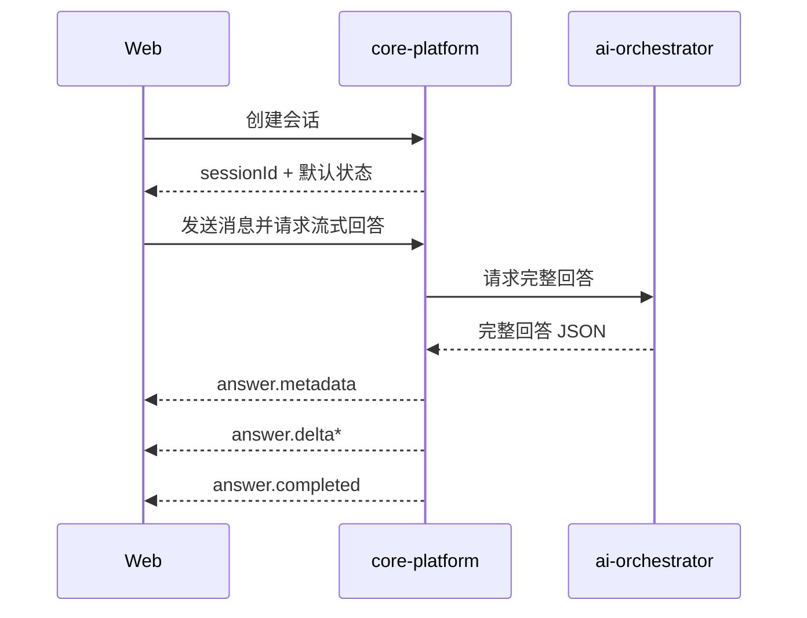

# 系统架构文档

## 文档信息
- **功能名称**：conversation-core
- **版本**：1.0
- **创建日期**：2026-04-06
- **作者**：Architect Agent

## 摘要

> 下游 Agent 请优先阅读本节，需要细节时再查阅完整文档。

- **架构模式**：Web 直接调用 Java 公共 API，Java 再调用 Python 编排服务；会话真相留在 Java，角色化生成留在 Python。
- **技术栈**：Next.js 15 + React 19；Spring Boot 3.3 + Java 21；FastAPI + Python 3.12。
- **核心设计决策**：只打通创建会话与单轮流式问答两条前台接口；SSE 对外只出现在 Java 层；Python 返回完整 JSON，再由 Java 切成事件流。
- **主要风险**：当前没有持久化、没有真实知识检索、没有角色切换与模式切换闭环。
- **项目结构**：共享前端类型放在 `packages/domain-sdk`；Web 页面在 `apps/web`；Java 会话模块在 `services/core-platform/src/main/java/com/tongfuli/platform/conversation`；Python 接口在 `services/ai-orchestrator/app/api`。

---

## 1. 架构概述

### 1.1 目标
本轮不是做“大而全”的娱乐问答系统，而是把最短的真实价值链路跑通：

1. Web 首页可输入问题。
2. 首次发送自动创建匿名会话。
3. Java 保存会话并对外暴露 SSE。
4. Java 调 Python 获取角色化回答。
5. Web 实时渲染增量文本与完成态。

### 1.2 系统架构图

```mermaid
graph LR
    W[Web 主对话页]
    J[core-platform 公共接口]
    S[(会话仓储<br/>当前内存实现)]
    P[ai-orchestrator 回答接口]

    W -->|POST /api/v1/public/sessions| J
    W -->|POST /api/v1/public/sessions/{id}/turns/stream| J
    J --> S
    J -->|HTTP JSON| P
    J -->|SSE| W
```

### 1.3 关键边界

| 边界 | 归属 | 说明 |
|------|------|------|
| 前台公共契约 | Java | 以 [`contracts/public-api.md`](/C:/code/virtue/tongfuli/contracts/public-api.md) 为准 |
| 会话状态真相 | Java | `sessionId`、默认角色、默认模式由 Java 维护 |
| 回答生成 | Python | 基于用户输入与角色、模式生成文本 |
| 展示状态 | Web | 消息列表、发送态、失败态、SSE 消费由前端维护 |

---

## 2. 技术选型与理由

| 层级 | 技术 | 选择理由 | 本轮使用方式 |
|------|------|----------|--------------|
| Web | Next.js 15 + React 19 | 现有项目已就绪，支持快速搭建真实交互页 | 直接在首页接入对话壳层 |
| 共享类型 | TypeScript workspace package | 避免前端手写字符串协议 | 定义会话与消息类型 |
| 公共 API | Spring Boot MVC | 现有服务已跑通，适合维护公开接口与 SSE | 暴露 `sessions` 与 `turns/stream` |
| 编排服务 | FastAPI | 轻量、适合快速固化回答接口模型 | 返回结构化回答 JSON |

不选的东西：
- 不接数据库，因为当前真问题是链路未通，不是持久化。
- 不引消息队列，因为这里只有单次请求-响应。
- 不让 Web 直接调 Python，因为会话真相和公开接口不在 Python。

---

## 3. 数据模型

### 3.1 会话对象

| 字段 | 类型 | 说明 |
|------|------|------|
| `sessionId` | `String` | 会话唯一标识 |
| `clientType` | `String` | 当前固定为 `web` |
| `currentMode` | `String` | 当前固定为 `canon` |
| `currentCharacterId` | `String` | 当前固定为 `char_baizhantang` |
| `createdAt` | `Instant` | 创建时间 |

### 3.2 轮次对象

| 字段 | 类型 | 说明 |
|------|------|------|
| `turnId` | `String` | 轮次标识 |
| `sessionId` | `String` | 所属会话 |
| `input` | `String` | 用户问题 |
| `answer` | `String` | 完整回答 |
| `actingCharacterId` | `String` | 本轮角色 |
| `mode` | `String` | 本轮模式 |
| `createdAt` | `Instant` | 生成时间 |

### 3.3 编排请求对象

| 字段 | 类型 | 说明 |
|------|------|------|
| `sessionId` | `string` | 上游会话标识 |
| `userInput` | `string` | 用户输入 |
| `actingCharacterId` | `string` | 当前角色 |
| `mode` | `string` | 当前模式 |

---

## 4. API 设计

### 4.1 Java 公共接口

| 方法 | 路径 | 用途 | 说明 |
|------|------|------|------|
| `POST` | `/api/v1/public/sessions` | 创建匿名会话 | 返回默认角色和模式 |
| `POST` | `/api/v1/public/sessions/{sessionId}/turns/stream` | 发送消息并流式获取回答 | 返回 `text/event-stream` |

### 4.2 SSE 事件约定

| 事件名 | 载荷 | 必须性 |
|--------|------|--------|
| `answer.delta` | `turnId`、`delta` | 必须 |
| `answer.metadata` | `turnId`、`actingCharacterId`、`mode` | 可选但建议 |
| `answer.completed` | `turnId`、`answer` | 必须 |
| `answer.error` | `message` | 必须 |

### 4.3 Python 内部接口

| 方法 | 路径 | 用途 |
|------|------|------|
| `POST` | `/internal/orchestration/answers` | 生成完整回答 |

返回结构建议：

```json
{
  "turnId": "turn_xxx",
  "answer": "老白口吻的完整回答",
  "actingCharacterId": "char_baizhantang",
  "mode": "canon"
}
```

---

## 5. 控制流设计

### 5.1 主时序



### 5.2 错误处理

- 会话不存在：Java 返回 404，不调用 Python。
- Python 超时或失败：Java 发 `answer.error` 并结束流。
- Web 解析失败：前端停止 loading，展示“回答流解析失败”。

---

## 6. 模块划分

### 6.1 Java

```text
conversation/
├── api/               控制器、请求响应 DTO
├── application/       会话创建与回答编排服务
├── domain/            Session / Turn / Mode / Character
└── infrastructure/    InMemory 仓储、Python HTTP 客户端
```

### 6.2 Python

```text
app/
├── api/
│   └── conversation.py
└── orchestration/
    └── service.py
```

### 6.3 Web

```text
app/
├── _components/
│   └── conversation-shell.tsx
├── _lib/
│   └── conversation-client.ts
└── page.tsx
```

---

## 7. 配置与安全

### 7.1 配置项

| 配置项 | 位置 | 默认值 |
|--------|------|--------|
| `tongfuli.orchestrator.base-url` | Java `application.yml` | `http://127.0.0.1:8001` |
| `NEXT_PUBLIC_CORE_API_BASE_URL` | Web 环境变量 | `http://127.0.0.1:8080` |

### 7.2 安全边界

- 仅开放 `/api/v1/public/**` 给匿名访问。
- 保持其他路径仍需认证。
- Java 增加本地开发 CORS，仅允许 `http://localhost:3000` 与 `http://127.0.0.1:3000`。

---

## 8. 测试策略

### 8.1 Java
- 单元测试：创建会话、未知会话、回答分片逻辑
- 接口测试：`POST /sessions` 与 `POST /turns/stream`

### 8.2 Python
- 接口测试：成功回答、空输入校验
- 服务测试：角色化文本差异

### 8.3 Web
- 构建验证：`pnpm --filter web build`
- 手工联调：首次发送、后端失败、重复发送

---

## 9. 兼容性与演进

- 当前使用内存仓储，但控制器不应感知存储实现。
- 未来接数据库时，只替换仓储实现。
- 未来做角色切换与模式切换时，优先扩展会话状态与 UI 控件，不改现有创建会话和流式回答主路径。

---

## 变更记录

| 版本 | 日期 | 作者 | 变更内容 |
|------|------|------|----------|
| 1.0 | 2026-04-06 | Architect Agent | 定义 conversation-core 的真实链路架构与接口边界 |
