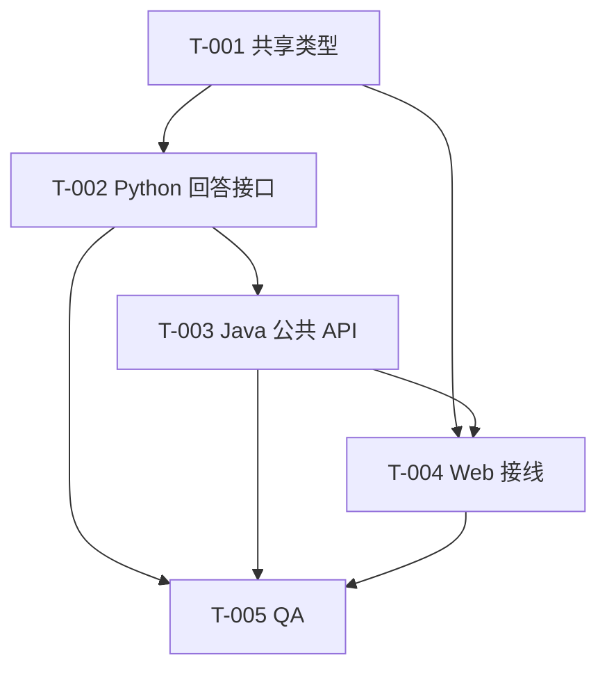

# 开发任务规格文档

## 文档信息
- **功能名称**：conversation-core
- **版本**：1.0
- **创建日期**：2026-04-06
- **作者**：Scrum Master Agent

## 摘要

> 下游 Agent 请优先阅读本节，需要细节时再查阅完整文档。

- **任务总数**：5 个
- **前端任务**：2 个
- **后端任务**：2 个
- **关键路径**：共享类型 -> Python 回答接口 -> Java 公共 API -> Web 对话页 -> QA
- **预估复杂度**：中

---

## 1. 任务概览

### 1.1 统计信息
| 指标 | 数量 |
|------|------|
| 总任务数 | 5 |
| 创建文件 | 8+ |
| 修改文件 | 8+ |
| 测试用例 | 6+ |

### 1.2 任务分布
| 复杂度 | 数量 |
|--------|------|
| 低 | 1 |
| 中 | 3 |
| 高 | 1 |

---

## 2. 任务详情

### Story: S-001 - 首页首条真实对话链路

#### Task T-001：共享前端对话类型

**类型**：修改

**目标文件**：
| 文件路径 | 操作 | 说明 |
|----------|------|------|
| `packages/domain-sdk/src/conversation.ts` | 创建 | 定义会话与消息类型 |
| `packages/domain-sdk/src/index.ts` | 修改 | 导出新类型 |

**实现步骤**：
1. 定义默认角色、模式、会话、消息、SSE 事件类型。
2. 不要把 UI 状态塞进共享类型，只保留公共协议。

**测试用例**：
- `pnpm --filter web build` 通过类型检查。

**复杂度**：低

**依赖**：无

---

#### Task T-002：Python 回答接口

**类型**：修改

**目标文件**：
| 文件路径 | 操作 | 说明 |
|----------|------|------|
| `services/ai-orchestrator/app/api/conversation.py` | 创建 | 内部回答接口 |
| `services/ai-orchestrator/app/orchestration/service.py` | 修改 | 角色化回答逻辑 |
| `services/ai-orchestrator/app/main.py` | 修改 | 注册路由 |
| `services/ai-orchestrator/tests/test_conversation_api.py` | 创建 | API 测试 |

**实现步骤**：
1. 定义请求模型与响应模型。
2. 基于角色和模式生成完整回答。
3. 校验空输入与非法值。

**测试用例**：
| 用例 ID | 描述 | 类型 |
|---------|------|------|
| TC-002-1 | 返回 200 与完整字段 | 集成测试 |
| TC-002-2 | 不同角色或模式返回不同文本 | 单元测试 |
| TC-002-3 | 空输入返回校验错误 | 集成测试 |

**复杂度**：中

**依赖**：T-001

---

#### Task T-003：Java 公共会话与流式接口

**类型**：修改

**目标文件**：
| 文件路径 | 操作 | 说明 |
|----------|------|------|
| `services/core-platform/src/main/java/com/tongfuli/platform/conversation/**` | 创建 | 会话领域、服务、API、适配器 |
| `services/core-platform/src/main/resources/application.yml` | 修改 | 增加编排配置 |
| `services/core-platform/src/main/java/com/tongfuli/platform/config/SecurityConfig.java` | 修改 | 放行 public API |
| `services/core-platform/src/test/java/com/tongfuli/platform/conversation/**` | 创建 | Java 测试 |

**实现步骤**：
1. 实现 `createSession`。
2. 实现 `streamTurn`，调用 Python，切分回答并输出 SSE。
3. 对未知会话与下游失败做错误处理。

**测试用例**：
| 用例 ID | 描述 | 类型 |
|---------|------|------|
| TC-003-1 | 创建会话返回默认角色和模式 | 单元测试 |
| TC-003-2 | 流式接口输出 `answer.completed` | 接口测试 |
| TC-003-3 | 未知会话返回 404 或错误事件 | 接口测试 |

**复杂度**：高

**依赖**：T-002

---

#### Task T-004：Web 主对话页接线

**类型**：修改

**目标文件**：
| 文件路径 | 操作 | 说明 |
|----------|------|------|
| `apps/web/app/page.tsx` | 修改 | 接入真实对话壳层 |
| `apps/web/app/_components/conversation-shell.tsx` | 创建 | 消息状态与交互逻辑 |
| `apps/web/app/_lib/conversation-client.ts` | 创建 | API 调用与 SSE 解析 |
| `apps/web/app/globals.css` | 修改 | 增强真实状态样式 |

**实现步骤**：
1. 首次发送时自动创建会话。
2. 消费 SSE 并更新消息列表。
3. 维护发送态、完成态、失败态。

**测试用例**：
- `pnpm --filter web build` 通过。

**复杂度**：中

**依赖**：T-001, T-003

---

#### Task T-005：QA 与流水线状态更新

**类型**：修改

**目标文件**：
| 文件路径 | 操作 | 说明 |
|----------|------|------|
| `.boss/conversation-core/qa-report.md` | 修改 | 填写验证结论 |
| `.boss/conversation-core/.meta/execution.json` | 修改 | 更新阶段状态 |

**实现步骤**：
1. 运行 Java 测试、Python 测试、Web 构建。
2. 记录通过项、失败项、剩余风险。
3. 将 stage1、stage2、stage3 状态更新准确。

**测试用例**：
- 验证命令本身即验收标准。

**复杂度**：中

**依赖**：T-002, T-003, T-004

---

## 3. 任务依赖图

---

## 4. 文件变更汇总

### 4.1 新建文件
| 文件路径 | 关联任务 | 说明 |
|----------|----------|------|
| `packages/domain-sdk/src/conversation.ts` | T-001 | 会话共享类型 |
| `services/ai-orchestrator/app/api/conversation.py` | T-002 | Python 对话接口 |
| `services/ai-orchestrator/tests/test_conversation_api.py` | T-002 | Python 接口测试 |
| `apps/web/app/_components/conversation-shell.tsx` | T-004 | Web 对话壳层 |
| `apps/web/app/_lib/conversation-client.ts` | T-004 | Web API 客户端 |

### 4.2 修改文件
| 文件路径 | 关联任务 | 变更类型 |
|----------|----------|----------|
| `services/core-platform/src/main/resources/application.yml` | T-003 | 增加配置 |
| `services/core-platform/src/main/java/com/tongfuli/platform/config/SecurityConfig.java` | T-003 | 开放 public 路径 |
| `apps/web/app/page.tsx` | T-004 | 首页接线 |
| `apps/web/app/globals.css` | T-004 | 状态样式升级 |

---

## 5. 代码规范提醒

- 控制器只做输入输出和状态码，不写业务编排。
- 不引入未来功能的半残接口。
- Web 状态机保持最小集合：`idle / creating / streaming / completed / error`。

---

## 变更记录

| 版本 | 日期 | 作者 | 变更内容 |
|------|------|------|----------|
| 1.0 | 2026-04-06 | Scrum Master Agent | 拆解 conversation-core 的实现任务与依赖 |
