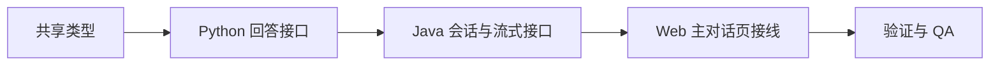

# 技术方案评审报告

## 1. 评审概述

- **项目名称**：conversation-core
- **评审日期**：2026-04-06
- **评审人**：Tech Lead Agent
- **评审文档**：
  - PRD：`.boss/conversation-core/prd.md`
  - 架构：`.boss/conversation-core/architecture.md`
  - UI：`.boss/conversation-core/ui-spec.md`

## 摘要

> 下游 Agent 请优先阅读本节，需要细节时再查阅完整文档。

- **评审结论**：✅ 通过
- **主要风险**：内存仓储重启即丢失；Python 回答仍是占位能力；前端 SSE 解析易写乱。
- **必须解决**：Java 公开放行 `/api/v1/public/**`；会话与回答逻辑不能写进控制器；错误路径要可测试。
- **建议优化**：共享类型抽到 `packages/domain-sdk`；配置项显式化；Web 保持最小状态机。
- **技术债务**：角色切换、模式切换、最近会话、依据展开、数据库持久化均延期。

---

## 2. 评审结论

| 维度 | 评分 | 说明 |
|------|------|------|
| 架构合理性 | ⭐⭐⭐⭐⭐ | 边界清晰，真实问题与实现规模匹配 |
| 技术选型 | ⭐⭐⭐⭐ | 沿用现有栈，没有过度设计 |
| 可扩展性 | ⭐⭐⭐⭐ | 仓储与网关抽象足够支撑后续演进 |
| 可维护性 | ⭐⭐⭐⭐ | 若控制器保持薄层，后续维护成本可控 |
| 安全性 | ⭐⭐⭐ | 匿名开放合理，但必须严格限定路径与来源 |

**总体评价**：值得做，而且现在就该做。继续停留在静态骨架才是更大的工程错误。

## 3. 风险评估

| 风险 | 等级 | 影响范围 | 缓解措施 |
|------|------|----------|----------|
| Web 自己解析 SSE 逻辑过于复杂 | 中 | 前端 | 只解析 4 个事件名，保持单一解析函数 |
| Java 直接依赖 Python JSON 细节 | 中 | 后端 | 封装内部客户端与响应 DTO |
| 当前没有会话持久化 | 中 | 后端 | 仓储接口先抽象，内存实现仅作为当前适配器 |

## 4. 技术可行性

| 功能 | 可行性 | 复杂度 | 说明 |
|------|--------|--------|------|
| 匿名创建会话 | 高 | 低 | 纯内存即可 |
| 单轮流式回答 | 高 | 中 | `SseEmitter` + 分片发送足够 |
| 角色化回答占位 | 高 | 低 | Python 模板化输出即可 |
| 页面实时展示 | 高 | 中 | React 状态驱动即可完成 |

## 5. 必做要求

- [x] 只做两条公共前台接口，不把角色切换等未来能力提前半做半不做
- [x] Java 控制器保持薄，业务逻辑放应用服务
- [x] Python 接口有显式请求/响应模型
- [x] Web 对失败态有明确反馈

## 6. 开发顺序建议

## 7. 代码规范建议

- 函数不要超过单一职责。
- 控制器不直接拼业务文案。
- 前端消息状态只保留 `pending / streaming / completed / error` 四类。

## 8. 评审结论

- **是否通过**：通过
- **阻塞问题数**：0
- **建议优化数**：3
- **下一步行动**：直接进入实现和验证
