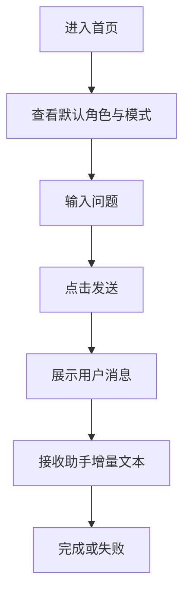

# UI/UX 规范文档

## 文档信息
- **功能名称**：conversation-core
- **版本**：1.0
- **创建日期**：2026-04-06
- **作者**：UI Designer Agent

## 摘要

> 下游 Agent 请优先阅读本节，需要细节时再查阅完整文档。

- **设计风格**：暖木色客栈氛围，不做紫色 SaaS 仪表盘风格。
- **主色调**：赭红 `#9d3d2f`、米杏 `#f5efe3`、深墨 `#2a2018`。
- **核心组件**：标题 Hero、会话状态条、消息列表、发送输入区、错误条。
- **响应式断点**：桌面端上下双卡片；移动端单列堆叠。
- **本轮重点**：把“首页静态骨架”升级成“能真实发问并看到角色化流式回答”的主界面。

---

## 1. 设计概述

### 1.1 设计理念
用户进入首页时，不该感觉自己到了一个等待施工的演示页，而应该像进了同福客栈门口，眼前就是能开口说话的“人”。因此页面中心必须始终是对话，而不是说明文案。

### 1.2 体验原则

- **直达**：输入框、发送动作、状态反馈全部在一个主视区内完成。
- **沉浸**：保留现有暖色调和客栈氛围，不改成通用后台审美。
- **诚实**：发送中、失败、完成都明确表达，不用伪动画掩盖真实状态。

---

## 2. 页面结构

### 2.1 信息架构

```text
Web 首页
├── Hero 面板
│   ├── 项目标识
│   ├── 主标题
│   └── 引导文案
└── Conversation 面板
    ├── 会话状态条
    ├── 消息列表
    ├── 错误提示条（条件显示）
    └── 输入区
```

### 2.2 主流程



---

## 3. 组件规范

### 3.1 Hero 面板

| 项 | 规范 |
|----|------|
| 作用 | 明确这是《武林外传》角色对话入口 |
| 文案 | 保留当前主标题，但副文案改成说明真实链路已接入 |
| 视觉 | 纸张质感底色、轻阴影、赭红强调色 |

### 3.2 会话状态条

| 字段 | 展示形式 |
|------|----------|
| 当前角色 | 固定文案：白展堂 |
| 当前模式 | 固定文案：原剧模式 |
| 会话状态 | `未创建` / `对话中` / `回答完成` / `请求失败` |

说明：本轮不做角色切换和模式切换交互，但状态条必须让用户知道当前以谁的口吻回答、处在哪个阶段。

### 3.3 消息列表

| 类型 | 视觉规则 |
|------|----------|
| 用户消息 | 右对齐、浅赭色背景、短尾气泡 |
| 助手消息 | 左对齐、白底气泡、顶部显示角色名 |
| 发送中助手消息 | 在助手消息位置持续追加文本，未完成前显示轻微闪动光标 |

### 3.4 输入区

| 项 | 规范 |
|----|------|
| 输入框 | 单行输入，圆角胶囊样式 |
| 发送按钮 | 赭红实心按钮 |
| 禁用条件 | 输入为空或正在请求中 |
| 键盘行为 | Enter 发送 |

### 3.5 错误条

| 项 | 规范 |
|----|------|
| 位置 | 输入框上方 |
| 样式 | 浅红米色背景 + 深色正文 |
| 文案 | 显示后端返回信息或通用失败文案 |

---

## 4. 状态设计

### 4.1 初始态
- 消息列表中保留一条欢迎语，提醒用户可以直接发问。
- 会话状态显示 `未创建`。

### 4.2 创建会话中
- 发送按钮进入 loading 感知态。
- 状态条显示 `正在创建会话`。

### 4.3 回答流式进行中
- 状态条显示 `对话中`。
- 助手消息逐步增长，底部保持自动滚动。

### 4.4 完成态
- 状态条显示 `回答完成`。
- 助手消息去掉流动光标。

### 4.5 失败态
- 状态条显示 `请求失败`。
- 错误条出现，但不清空输入框与历史消息。

---

## 5. 响应式规范

### 桌面端
- 页面左右边距保留较大留白。
- Hero 和 Conversation 面板上下排列，每块卡片有足够呼吸感。

### 移动端
- 页面边距缩小到 `16px`。
- 会话状态条允许换行。
- 发送按钮仍保持足够点击面积。

---

## 6. 视觉令牌

| 变量 | 值 | 用途 |
|------|----|------|
| `--bg` | `#f3ecdf` | 页面背景 |
| `--panel` | `#fff9ef` | 面板背景 |
| `--ink` | `#2a2018` | 正文文字 |
| `--accent` | `#9d3d2f` | 强调色 |
| `--border` | `#d8c2a1` | 边框 |
| `--danger-bg` | `#f8e7df` | 错误背景 |

---

## 7. 无障碍要求

- 输入框有 `aria-label`。
- 发送按钮在禁用态有明确视觉反馈。
- 新消息区域使用可理解的语义结构，便于后续做可访问增强。

---

## 变更记录

| 版本 | 日期 | 作者 | 变更内容 |
|------|------|------|----------|
| 1.0 | 2026-04-06 | UI Designer Agent | 固化 Web 主对话页的真实交互与视觉方向 |
